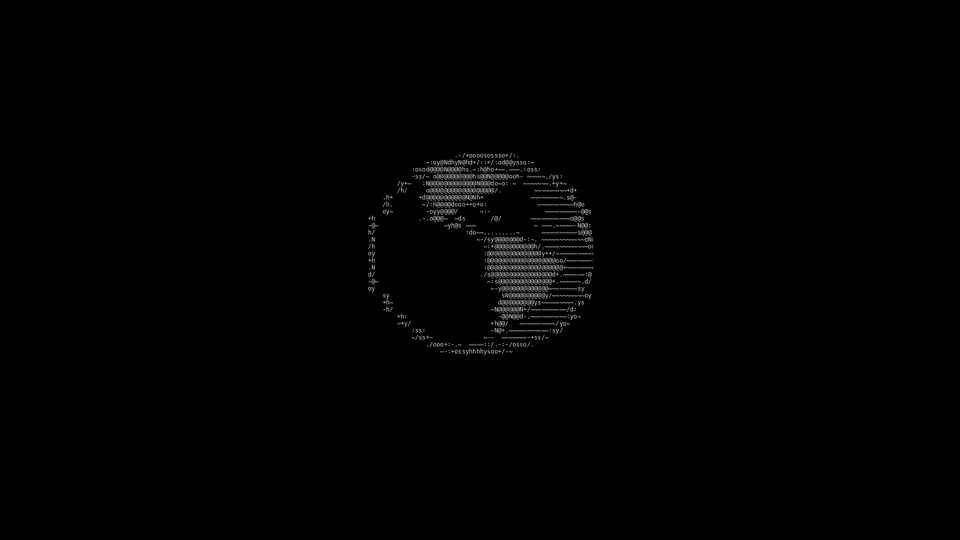

# blackrise

Чёрно-белый райс Hyprland для Fedora. Чёрный фон, белый акцент, ни одного серого цвета,
всё круглое, ASCII-детали. Вместо готовых панелей свои лёгкие компоненты на GTK4,
повторяющие удобство GNOME.



## Что внутри

- **Док слева.** Закреплённые программы, открытые окна, часы, раскладка, кнопка центра управления.
- **Обзор по Super.** Поиск приложений, сетка столов с живыми миниатюрами, перетаскивание окон.
  Внизу свёрнутые окна и значки фоновых приложений (трей: Telegram, Discord, сеть…).
- **Центр управления как в GNOME.** Звук и микрофон с выбором устройства, Wi-Fi, VPN,
  режим питания, «не беспокоить», меню питания.
- **Снимок экрана как в GNOME.** Выделение / экран / окно, фото / видео, снимок по Пробелу.
- **Буфер обмена.** Порт GNOME-расширения Clipboard Indicator: история, закреплённые записи.
- **Экран блокировки.** Блочные ASCII-часы и вращающаяся ASCII-Земля, настоящая
  блокировка Wayland (ext-session-lock) с проверкой пароля через PAM.
- **Загрузка.** Тема Plymouth с той же Землёй.
- **Ghostty, fastfetch, wofi, swaync, wlogout, GTK4, Chrome, Telegram, VS Code** в том же стиле.
- Флешки монтируются сами, Ctrl+V с картинкой в терминале передаёт её программе (удобно для Claude Code).

## Установка

Fedora 43, видеокарта с OpenGL 3.3+.

```sh
git clone https://github.com/ecronxy/blackrise
cd blackrise
./install.sh            # пакеты, шрифт, курсор, конфиги; старые конфиги уходят в бэкап
./install.sh --boot     # то же + тема загрузки (пересоберёт initramfs)
```

Потом выйди из сессии и выбери **Hyprland** на экране входа.

Мониторы по умолчанию ставятся в родном разрешении. Свои мониторы и основной монитор
(где живут док, центр управления и поле пароля) задаются в начале `~/.config/hypr/mono/main.conf`.

Откат: `./uninstall.sh` (конфиги из бэкапа), загрузка: `sudo plymouth-set-default-theme -R bgrt`.

## Клавиши

| Сочетание | Что |
|---|---|
| Super (нажать и отпустить) | обзор окон и поиск приложений |
| Super + Space / R | меню приложений |
| Super + Return | терминал |
| Super + B / E | браузер / файлы |
| Super + Q | закрыть окно |
| Super + F / Shift+F | на весь экран / плавающее |
| Super + M | свернуть |
| Super + 1…0 | рабочие столы, с Shift: перенести окно |
| Super + V | буфер обмена |
| Super + X | центр управления |
| Super + Escape | меню выключения |
| Super + L | заблокировать |
| Super + Shift + S, Ctrl + Shift + S, Print | снимок / запись экрана |
| Super + I | настройки |

В снимке экрана: S / C / W — выделение / экран / окно, V — видео, P — курсор, Пробел — снять.

## Темы для программ

- **Chrome:** `chrome://extensions` → режим разработчика → «Загрузить распакованное» →
  `~/.local/share/mono-themes/chrome-mono`.
- **Telegram:** открыть `~/.local/share/mono-themes/telegram-mono.tdesktop-theme`.
- **VS Code (скругления):** `sudo ~/.local/share/vscode-mono/apply.sh`, откат `rollback.sh` рядом.

## Слабое железо

Райс делался на Athlon 3000G с Vega 3: размытие в один проход, без теней,
компоненты висят фоновыми процессами и открываются мгновенно по сигналу.

Сторонние материалы и их лицензии: [NOTICE.md](NOTICE.md).
